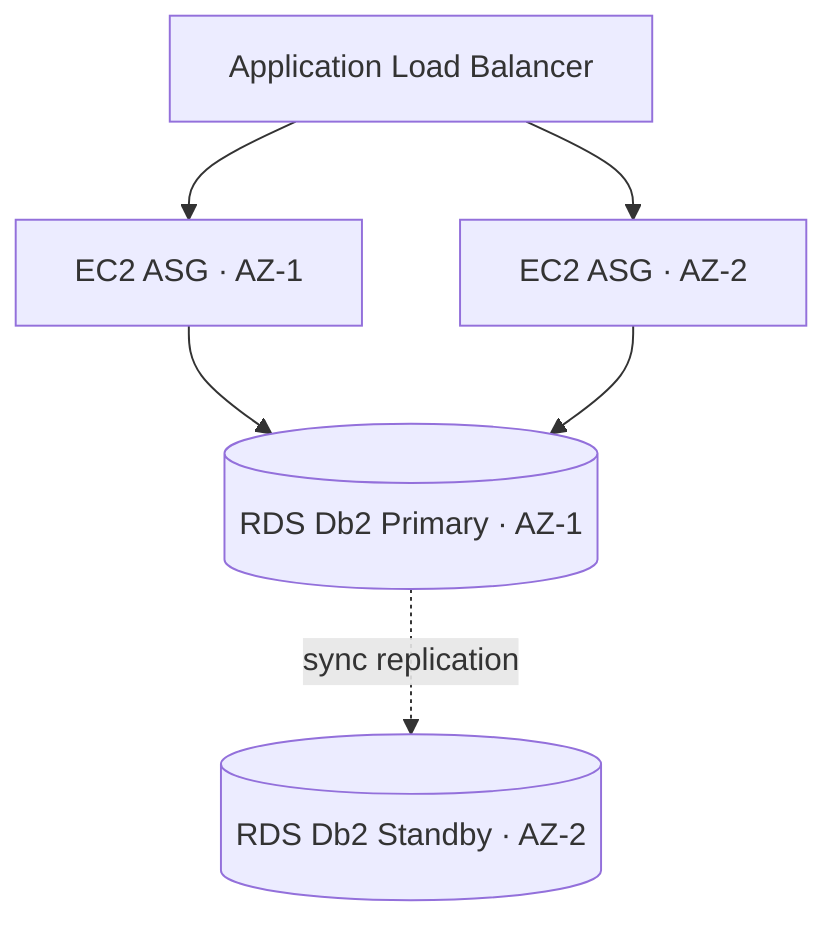

# RDS for Db2 — EC2/RDS Colocation for Multi-AZ Reference

> **Source:** `EC2_RDS_COLOCATION_GUIDE.md` (Cloud-Formation root). AWS CLI commands and
> option names are reproduced from that source; no secret values, credentials, customer IDs,
> or contact data are included — replace every `<placeholder>`.

---

## Why colocation matters

In Multi-AZ, the active RDS for Db2 instance can be in either AZ, and it changes AZ on failover.
To keep application-to-database latency low and survive an AZ loss, run application instances in
**both** AZs behind an Application Load Balancer (ALB) via an Auto Scaling Group (ASG). This gives
automatic same-AZ routing, no manual intervention on failover, and no instance-to-instance
synchronization — each instance connects to the same RDS endpoint and stays stateless (use
ElastiCache or DynamoDB for session state).



## 1. Identify the RDS AZs

```bash
aws rds describe-db-instances \
  --db-instance-identifier <your-db-instance-id> \
  --query 'DBInstances[0].[AvailabilityZone,SecondaryAvailabilityZone]' \
  --output table
```

## 2. Create ALB, target group, listener

```bash
aws elbv2 create-load-balancer --name db2-app-alb \
  --subnets <subnet-az1> <subnet-az2> --security-groups <alb-security-group> \
  --scheme internet-facing --type application --ip-address-type ipv4

aws elbv2 create-target-group --name db2-app-targets \
  --protocol HTTP --port 80 --vpc-id <your-vpc-id> \
  --health-check-path /health --health-check-interval-seconds 30

aws elbv2 create-listener --load-balancer-arn <alb-arn> \
  --protocol HTTP --port 80 \
  --default-actions Type=forward,TargetGroupArn=<target-group-arn>
```

## 3. Launch template + ASG spanning both AZs

```bash
aws ec2 create-launch-template --launch-template-name db2-app-template \
  --version-description "DB2 application v1.0" \
  --launch-template-data '{"ImageId":"<your-ami-id>","InstanceType":"t3.medium",
    "SecurityGroupIds":["<app-security-group>"],
    "IamInstanceProfile":{"Name":"<instance-profile-name>"}}'

aws autoscaling create-auto-scaling-group --auto-scaling-group-name db2-app-asg \
  --launch-template LaunchTemplateName=db2-app-template,Version='$Latest' \
  --min-size 2 --max-size 6 --desired-capacity 4 --default-cooldown 300 \
  --health-check-type ELB --health-check-grace-period 300 \
  --vpc-zone-identifier "<subnet-az1>,<subnet-az2>" \
  --target-group-arns <target-group-arn>
```

`--vpc-zone-identifier` listing both subnets is what spreads instances across both AZs.

## 4. Security groups — scope to a specific source, never `0.0.0.0/0`

Restrict ALB ingress to a known client range, and let the app and RDS layers reference the
upstream security group rather than an IP range.

```bash
# ALB ingress — a SPECIFIC trusted CIDR (replace with your corporate/VPC range).
# Do NOT use 0.0.0.0/0; if a public endpoint is unavoidable, front it with WAF and
# document the exception explicitly.
aws ec2 authorize-security-group-ingress --group-id <alb-sg-id> \
  --protocol tcp --port 443 --cidr <trusted-cidr>     # e.g. 203.0.113.0/24

# App instances accept traffic only from the ALB security group
aws ec2 authorize-security-group-ingress --group-id <app-sg-id> \
  --protocol tcp --port 80 --source-group <alb-sg-id>

# RDS accepts Db2 (50000) only from the app security group
aws ec2 authorize-security-group-ingress --group-id <rds-sg-id> \
  --protocol tcp --port 50000 --source-group <app-sg-id>
```

Using `--source-group` ties access to identity, not addresses, so it keeps working after failover.

## 5. Failover alerting — SNS + EventBridge

```bash
# Create the topic ENCRYPTED FROM INCEPTION — pass KmsMasterKeyId inline on
# create-topic so the topic is never momentarily unencrypted. Failover
# notifications can carry sensitive RDS instance details.
aws sns create-topic --name rds-db2-az-change-alerts \
  --attributes KmsMasterKeyId=arn:aws:kms:<region>:<account>:key/<key-id>

# (For an existing unencrypted topic, enable SSE after the fact instead:)
# aws sns set-topic-attributes --topic-arn <topic-arn> \
#   --attribute-name KmsMasterKeyId \
#   --attribute-value arn:aws:kms:<region>:<account>:key/<key-id>

aws sns subscribe --topic-arn <topic-arn> \
  --protocol email --notification-endpoint <your-email@example.com>

aws events put-rule --name rds-db2-failover-detection \
  --event-pattern '{"source":["aws.rds"],
    "detail-type":["RDS DB Instance Event"],
    "detail":{"EventCategories":["failover"],
      "SourceIdentifier":["<your-db-instance-id>"]}}' \
  --state ENABLED

aws events put-targets --rule rds-db2-failover-detection \
  --targets "Id"="1","Arn"="<topic-arn>"
```

**Authorize recipients.** Failover notifications carry sensitive RDS instance details, so confirm
the email subscription (recipients must accept the confirmation email) and verify the endpoint
belongs to an authorized operations team member before relying on it. Audit the subscriber list
periodically with `aws sns list-subscriptions-by-topic --topic-arn <topic-arn>` and remove stale or
unrecognized endpoints.

Optional: add a Lambda target on the same rule to call `rds describe-db-instances` and publish
the new active AZ and endpoint in the notification. Grant it `rds:DescribeDBInstances` and
`sns:Publish` on the topic only, and add `lambda add-permission` for `events.amazonaws.com`.

## 6. Connect via the RDS endpoint (never instance IPs)

```python
import ibm_db
# Use the RDS endpoint — it always resolves to the active instance after failover.
conn_str = f"DATABASE={db_name};HOSTNAME={rds_endpoint};PORT=50000;PROTOCOL=TCPIP;UID={user};PWD={pwd};"
conn = ibm_db.connect(conn_str, "", "")
```

Source credentials from Secrets Manager or the RDS managed master password; never hard-code them.
Implement a `/health` endpoint that opens and closes a Db2 connection so the ALB drops unhealthy
instances.

## 7. Latency check + CloudWatch alarms

```bash
# From an instance, measure TCP latency to the endpoint
for i in {1..5}; do start=$(date +%s%N); \
  timeout 2 bash -c "cat < /dev/null > /dev/tcp/<rds-endpoint>/50000" 2>/dev/null; \
  end=$(date +%s%N); echo "$(( (end-start)/1000000 ))ms"; done

aws cloudwatch put-metric-alarm --alarm-name high-db-latency \
  --metric-name ReadLatency --namespace AWS/RDS \
  --dimensions Name=DBInstanceIdentifier,Value=<your-db-instance-id> \
  --statistic Average --period 60 --threshold 0.02 \
  --comparison-operator GreaterThanThreshold \
  --evaluation-periods 3 \
  --alarm-actions <topic-arn>
```

The alarm name and the metric must agree: `high-db-latency` watches `ReadLatency`
(seconds; `0.02` = 20 ms). To alarm on connection **count** instead, use a separate
alarm named `high-db-connections` with `--metric-name DatabaseConnections`.

Verify spread with `aws autoscaling describe-auto-scaling-groups` and
`aws elbv2 describe-target-health`.

## Cost notes

- Right-size instances and scale on metrics; start small.
- Use Savings Plans for steady usage.
- Enable detailed monitoring only while troubleshooting.
- Cross-AZ transfer stays minimal because most traffic is same-AZ by design.

## Related

- HA/DR fundamentals: `references/ha-dr.md`
- Connectivity and TLS: `references/connectivity.md`, `references/connectivity-tls.md`
